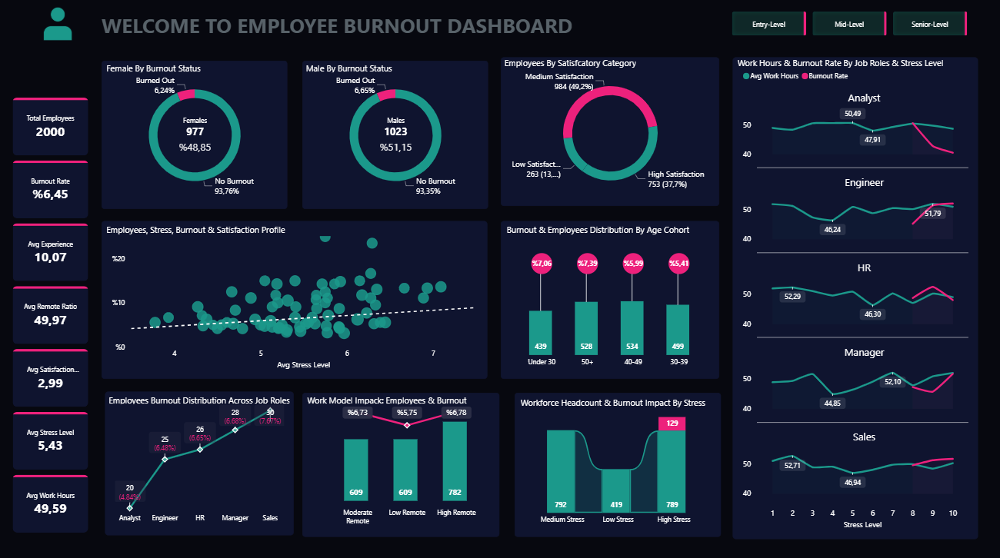
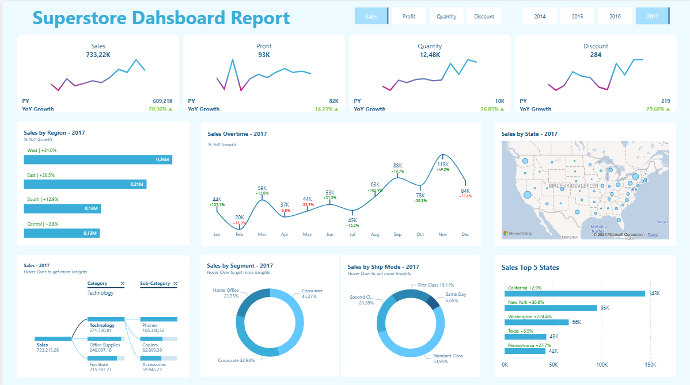

**EN - English Description**

*This repository contains the sample Power BI dashboards I created during my learning process.*

*The dashboards were created by following exercises from an online training resource.*
## 

## 📦 E-Commerce Dashboard

The report summarizes key e-commerce performance metrics:

📊 KPI cards (Sales, Quantity, Orders, AOV)

🔁 YoY comparison

📈 Time-series trend analysis

🗂️ Category-level & segment-level breakdowns

🗺️ Geographic analysis using map visuals

🏆 Top-N ranking tables

  

 📊 Data Source: <a href="https://www.kaggle.com/datasets/tanishqpratap/e-commerce-orders-dataset/data" target="_blank">Kaggle - E-Commerce Orders Dataset</a>

---
---

## 📦 HR Burnout Dashboard

This project focuses on analyzing employee burnout patterns using Power BI.
The report highlights key workforce metrics and visualizes relationships between stress levels, satisfaction, job roles, age cohorts, and remote work models.

Includes:

📊 Burnout rate KPIs

👥 Gender-based burnout distribution

😊 Employee satisfaction segmentation

📈 Stress–burnout correlation scatter plot

🧩 Burnout by job roles & age groups

🏠 Impact of remote work model

📉 Work hours vs. burnout trends by job role

  

 📊 Data Source: <a href="https://www.kaggle.com/datasets/ankam6010/synthetic-hr-burnout-dataset/data" target="_blank">Kaggle - Synthetic HR Burnout Dataset</a>

---
---

## 📦 Adidas Sales Dashboard

This dashboard examines Adidas sales data and presents sales, profit, and unit trends across regions, product groups, and sales channels.

Includes:

📊 Key KPIs — Total Sales, Operating Profit, Units Sold, Profit Margin with YoY & MoM trends

🗺️ Regional Sales Breakdown — Comparative sales performance across Midwest, Northeast, South, Southeast, and West

📈 Monthly & Daily Trends — Dual-line area chart showing sales and profit fluctuations over time

🏬 Top Retail Partners — Sales contribution of major partners like Amazon, Foot Locker, Kohl’s, and West Gear

🛍️ Product Insights — Category-level bar chart highlighting top-selling footwear and apparel items

📌 Channel Tabs — In-store, Online, and Outlet views for flexible filtering and analysis

  

 📊 Data Source: <a href="https://www.kaggle.com/datasets/ahmedabbas757/dataset" target="_blank">Kaggle - Adidas Sales</a>

---
---
## 📦 Superstore Sales Dashboard

This project presents a sales performance dashboard built in Power BI using the Superstore dataset.
The report focuses on year-over-year performance, regional insights, and category-based sales breakdowns.

Includes:

📊 KPI cards for Sales, Profit, Quantity, and Discount

🔄 YoY growth analysis

🌍 Sales by region and state

📈 Monthly sales trend analysis

🧩 Category & sub-category breakdown

🧭 Segment and ship mode distributions

⭐ Top-performing states

  

 📊 Data Source: <a href="https://www.kaggle.com/datasets/vivek468/superstore-dataset-final" target="_blank">Kaggle - Superstore Dataset</a>

---
---

**TR - Türkçe Açıklama**

*Bu repository, öğrenme sürecim sırasında oluşturduğum örnek Power BI dashboard'larını içermektedir.* 
*Bu dashboard'lar çevrimiçi bir eğitim kaynağındaki alıştırmalar izlenerek oluşturulmuştur.*
##

## 📦 E-Ticaret Dashboard

Bu dashboard, temel e-ticaret performans metriklerini özetlemektedir:

📊 KPI kartları (Satış, Adet, Sipariş, Ortalama Sipariş Değeri)

🔁 Yıllık karşılaştırma (YoY)

📈 Zaman serisi trend analizleri

🗂️ Kategori ve segment bazlı dağılımlar

🗺️ Harita görselleriyle coğrafi analiz

🏆 Top-N sıralama tabloları

---
---

## 📦 HR Burnout Dashboard

Bu proje, çalışan tükenmişliği (burnout) ile ilgili kalıpları analiz etmek amacıyla Power BI kullanılarak hazırlanmıştır.
Rapor, çalışan memnuniyeti, stres seviyesi, iş rolleri, yaş grupları ve uzaktan çalışma modelinin tükenmişlik üzerindeki etkilerini görselleştirir.

İçerikler:

📊 Tükenmişlik oranı KPI’ları

👥 Cinsiyete göre tükenmişlik dağılımı

😊 Memnuniyet kategorilerine göre segmentasyon

📈 Stres–tükenmişlik ilişki analizi (scatter plot)

🧩 İş rolü ve yaş gruplarına göre tükenmişlik dağılımı

🏠 Uzaktan çalışma modelinin etkisi

📉 İş rolleri bazında çalışma saatleri ve tükenmişlik trendi

---
---

## 📦 Adidas Satış Dashboard

Bu dashboard, Adidas satış verilerini inceleyerek bölgeler, ürün grupları ve satış kanalları üzerinden satış, kâr ve adet trendlerini gösterir.

📊 KPI Kartları — Toplam Satış, Faaliyet Kârı, Satılan Ürün Adedi, Kâr Marjı (YoY & MoM değişimleriyle)

🗺️ Bölgesel Satışlar — Midwest, Northeast, South, Southeast ve West bölgelerinin satış karşılaştırmaları

📈 Aylık & Günlük Trendler — Satış ve kârın zaman içindeki değişimini gösteren alan grafik

🏬 Perakende Partner Analizi — Amazon, Foot Locker, Kohl’s ve West Gear gibi mağazaların satış katkıları

🛍️ Ürün Analizi — Ayakkabı ve giyim kategorilerinin satış ve adet bazlı karşılaştırmaları

📌 Kanal Sekmeleri — Mağaza İçi, Online ve Outlet görünümleriyle kanal bazlı analiz

---
---

## 📦 Superstore Satış Dashboard

Bu çalışma, Superstore veri seti kullanılarak Power BI’da oluşturulmuş bir satış performansı dashboard’ıdır.
Rapor; yıllık karşılaştırmalar, bölgesel satış dağılımları ve kategori bazlı satış kırılımlarına odaklanır.

📊 Satış, Kâr, Adet ve İndirim için KPI kartları

🔄 Yıllık karşılaştırma (YoY) analizi

🌍 Bölge ve eyalet bazında satışlar

📈 Aylık satış trendi analizi

🧩 Kategori ve alt kategori kırılımları

🧭 Segment ve gönderi yöntemi dağılımları

⭐ En yüksek performans gösteren eyaletler
